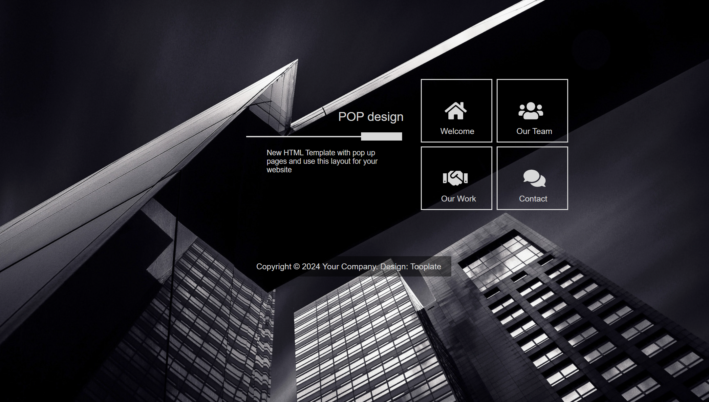

# My Web Project

This repository contains the files and resources for my web project. Below you'll find the details about the project structure, how to set it up, and the purpose of each file.

## Table of Contents

- [Project Overview](#project-overview)
- [Folder Structure](#folder-structure)
- [Files and Directories](#files-and-directories)
- [Prerequisites](#prerequisites)
- [Installation and Usage](#installation-and-usage)

## Project Overview



## Folder Structure

The project directory structure is as follows:

## Files and Directories

### css/style.css

This file contains the CSS styles for the project.

### img/

This folder contains images used in the project:

- `(13).png`
- `overview.png`
- `pop-bg.jpg`

### all.min.css

This file contains minified CSS styles for the project.

### all.min.js

This file contains minified JavaScript code for the project.

### index.html

This is the main HTML file for the project. It includes the structure and content of the webpage.

### README.md

This file contains the documentation for the project.

## Prerequisites

Before you begin, ensure you have met the following requirements:

- You have a web browser installed (e.g., Google Chrome, Mozilla Firefox).
- You have a text editor installed (e.g., VSCode, Sublime Text).

## Installation and Usage

To get a local copy up and running, follow these simple steps:

1. Clone the repository to your local machine:

    ```sh
    git clone https://github.com/mani-tayefeh/Session2_WebDev.git
    ```

2. Navigate to the project directory:

    ```sh
    cd Session2_WebDev
    ```

3. Open the `index.html` file in your web browser to view the webpage:
    - Double-click the `index.html` file.
    - Alternatively, right-click the file and select "Open with" and choose your preferred web browser.
