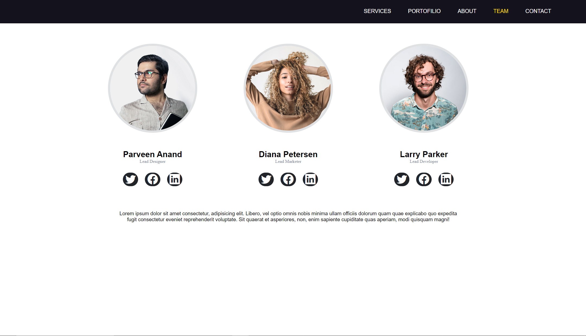
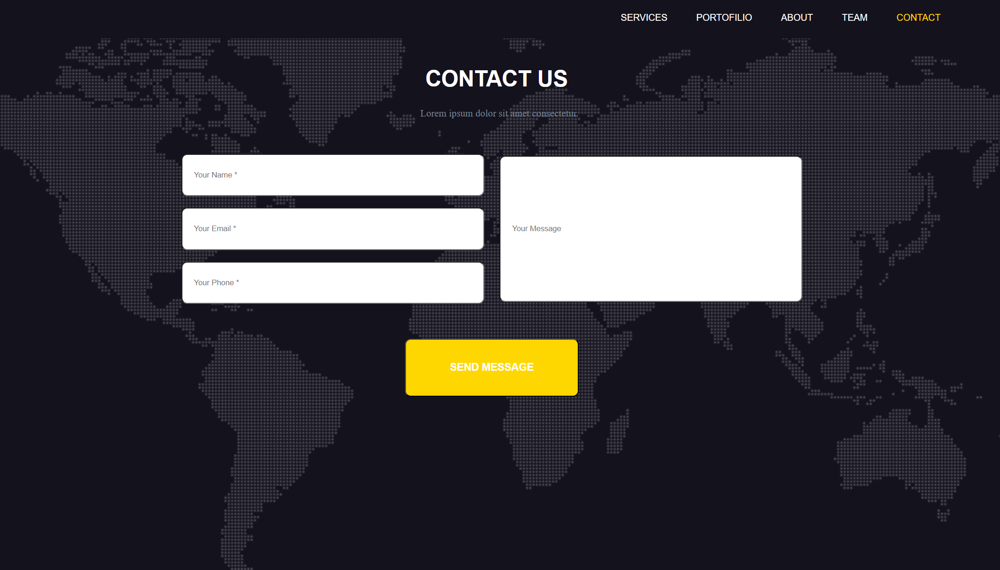

# Session4_WebDev Project

This repository contains files and resources for the "Session4_WebDev" project. Below you'll find details about the project structure, how to set it up, and the purpose of each file.

## Table of Contents

- [Project Overview](#project-overview)
- [Folder Structure](#folder-structure)
- [Files and Directories](#files-and-directories)
- [Prerequisites](#prerequisites)
- [Installation and Usage](#installation-and-usage)

## Project Overview

Main Page:


Team Page:



Contact Page:



## Folder Structure

The project directory structure is as follows:

## Files and Directories

### css/

This folder is intended for CSS files that style the project. Currently, it's empty, but you can add your CSS files here.

### img/

This folder contains images used in the project:

- `1 (18).png`
- `1.jpg`
- `2.jpg`
- `3.jpg`
- `header-bg.jpg`
- `map-image.png`
- `overview-contact.png`
- `overview-main.png`
- `overview-teampng.png`

### Contact.html

This file contains the HTML for the Contact page of the project.

### Main.html

This file contains the main HTML for the project.

### README.md

This file contains the documentation for the project.

### Team.html

This file contains the HTML for the Team page of the project.

## Prerequisites

Before you begin, ensure you have met the following requirements:

- You have a web browser installed (e.g., Google Chrome, Mozilla Firefox).
- You have a text editor installed (e.g., VSCode, Sublime Text).

## Installation and Usage

To get a local copy up and running, follow these simple steps:

1. Clone the repository to your local machine:

    ```sh
    git clone https://github.com/mani-tayefeh/Session4_WebDev.git
    ```

2. Navigate to the project directory:

    ```sh
    cd Session4_WebDev
    ```

3. Open the `Main.html` file in your web browser to view the webpage:
    - Double-click the `Main.html` file.
    - Alternatively, right-click the file and select "Open with" and choose your preferred web browser.

## Contribution

If you would like to contribute to this project, you can follow these steps:

1. Fork the repository
2. Create a new branch (Feature Branch)
3. Commit your changes
4. Push your branch
5. Submit a pull request

## License

This project is licensed under the [License Type].
